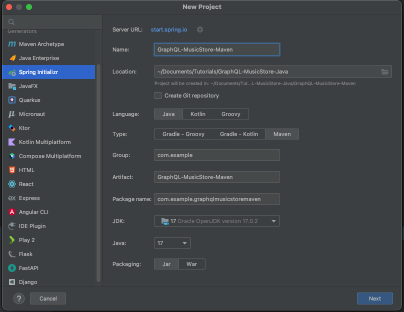
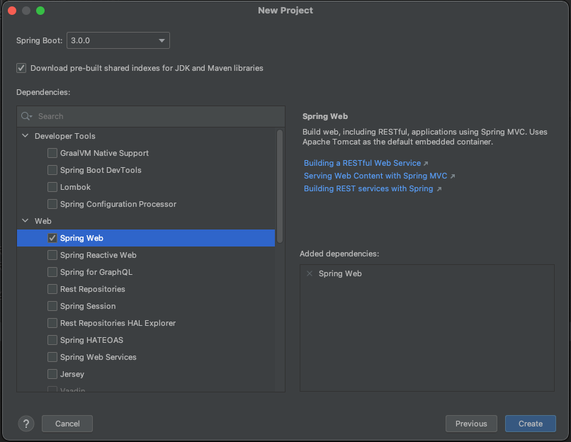
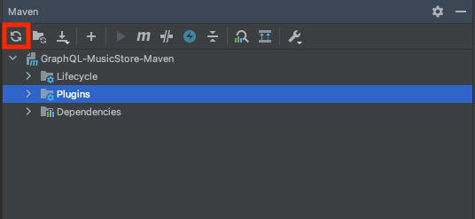
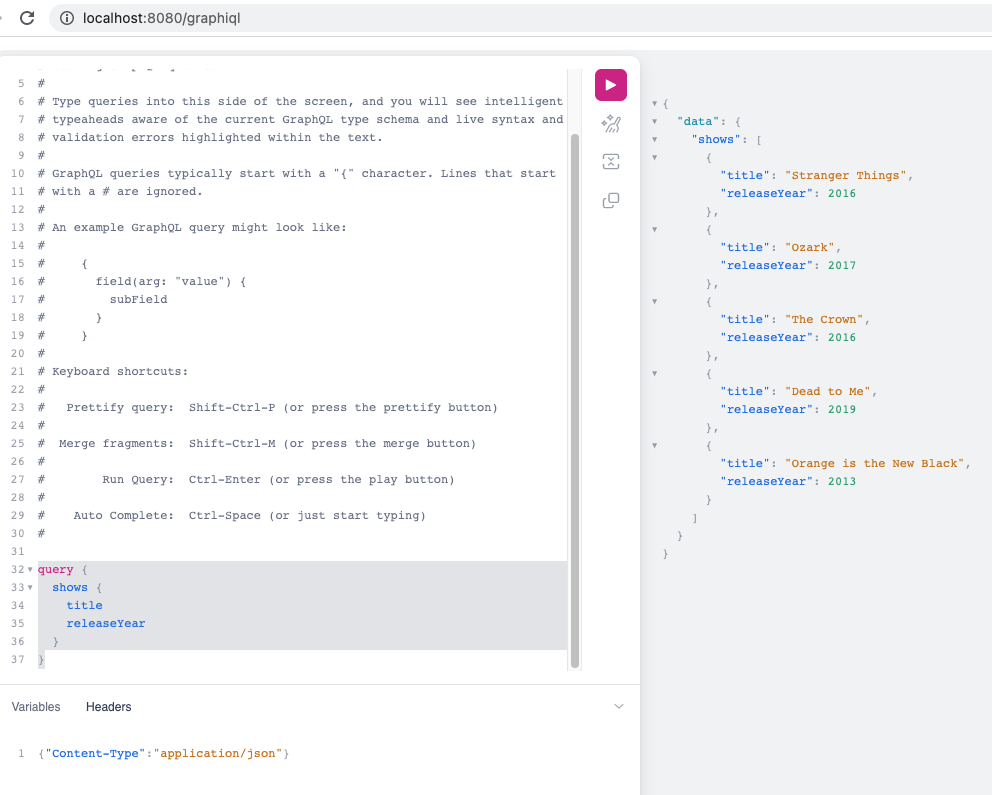

# Getting Started with GraphQL DGS
## Create Spring Boot Project
Add the `Spring Initializr` plugin on IntelliJ

On IntelliJ goto `file` -> `new`



Set
- Language: Java
- Type: Maven
- JDK: 17
- Java: 17
- Package: Jar

Then click `Next`


The only dependency you will need is `Spring Web`

Click `Create`, now you created a Spring Boot Project

## Add GraphQL DGS
In pom.xml add the following dependencies
```
<dependencyManagement>
    <dependencies>
        <dependency>
            <groupId>com.netflix.graphql.dgs</groupId>
            <artifactId>graphql-dgs-platform-dependencies</artifactId>
            <!-- The DGS BOM/platform dependency. This is the only place you set version of DGS -->
            <version>4.9.16</version>
            <type>pom</type>
            <scope>import</scope>
        </dependency>
    </dependencies>
</dependencyManagement>

<dependencies>
    <dependency>
        <groupId>com.netflix.graphql.dgs</groupId>
        <artifactId>graphql-dgs-spring-boot-starter</artifactId>
    </dependency>
</dependencies>
```

At the current time Dec. 2022, spring `spring-boot-starter-parent` version `3.0.0` 
does no support DGS. When accessing the `http:localhost:8080/graphiql` endpoint you will get
a whitelabel error, but will work for version `2.7.0`.

```
   <parent>
        <groupId>org.springframework.boot</groupId>
        <artifactId>spring-boot-starter-parent</artifactId>
        <version>2.7.0</version>
        <relativePath/> <!-- lookup parent from repository -->
    </parent>
```

There is a DGS plugin that automate the generation of Java class from types in GraphQL schema.
Special thanks to [deweyjose](https://github.com/deweyjose) for implementing that plugin in Maven.
```
            <plugin>
                <groupId>io.github.deweyjose</groupId>
                <artifactId>graphqlcodegen-maven-plugin</artifactId>
                <version>1.18</version>
                <executions>
                    <execution>
                        <goals>
                            <goal>generate</goal>
                        </goals>
                    </execution>
                </executions>
                <configuration>
                    <schemaPaths>
                        <param>src/main/resources/schema/schema.graphqls</param>
                    </schemaPaths>
                    <packageName>${project.groupId}.graphqlmusicstoremaven.generated</packageName>
                </configuration>
            </plugin>
```

The resulting build.gradle
```xml
<?xml version="1.0" encoding="UTF-8"?>
<project xmlns="http://maven.apache.org/POM/4.0.0" xmlns:xsi="http://www.w3.org/2001/XMLSchema-instance"
         xsi:schemaLocation="http://maven.apache.org/POM/4.0.0 https://maven.apache.org/xsd/maven-4.0.0.xsd">
    <modelVersion>4.0.0</modelVersion>
    <parent>
        <groupId>org.springframework.boot</groupId>
        <artifactId>spring-boot-starter-parent</artifactId>
        <version>2.7.0</version>
        <relativePath/> <!-- lookup parent from repository -->
    </parent>
    <groupId>com.example</groupId>
    <artifactId>GraphQL-MusicStore-Maven</artifactId>
    <version>0.0.1-SNAPSHOT</version>
    <name>GraphQL-MusicStore-Maven</name>
    <description>GraphQL-MusicStore-Maven</description>
    <properties>
        <java.version>17</java.version>
    </properties>
    <dependencyManagement>
        <dependencies>
            <dependency>
                <groupId>com.netflix.graphql.dgs</groupId>
                <artifactId>graphql-dgs-platform-dependencies</artifactId>
                <!-- The DGS BOM/platform dependency. This is the only place you set version of DGS -->
                <version>4.9.16</version>
                <type>pom</type>
                <scope>import</scope>
            </dependency>
        </dependencies>
    </dependencyManagement>

    <dependencies>
        <dependency>
            <groupId>org.springframework.boot</groupId>
            <artifactId>spring-boot-starter-web</artifactId>
        </dependency>

        <dependency>
            <groupId>com.netflix.graphql.dgs</groupId>
            <artifactId>graphql-dgs-spring-boot-starter</artifactId>
        </dependency>

        <dependency>
            <groupId>org.springframework.boot</groupId>
            <artifactId>spring-boot-starter-test</artifactId>
            <scope>test</scope>
        </dependency>
    </dependencies>

    <build>
        <plugins>
            <plugin>
                <groupId>io.github.deweyjose</groupId>
                <artifactId>graphqlcodegen-maven-plugin</artifactId>
                <version>1.18</version>
                <executions>
                    <execution>
                        <goals>
                            <goal>generate</goal>
                        </goals>
                    </execution>
                </executions>
                <configuration>
                    <schemaPaths>
                        <param>src/main/resources/schema/schema.graphqls</param>
                    </schemaPaths>
                    <packageName>${project.groupId}.graphqlmusicstoremaven.generated</packageName>
                </configuration>
            </plugin>

            <plugin>
                <groupId>org.springframework.boot</groupId>
                <artifactId>spring-boot-maven-plugin</artifactId>
            </plugin>
        </plugins>
    </build>

</project>
```
## Add GraphQL Schema
Create a directory in `resources` called `schema`. Create a file called `schema.graphqls` under `schema` directory.

`src/main/resources/schema/schema.graphqls`
```
type Query {
    shows(titleFilter: String): [Show]
}

type Show {
    title: String
    releaseYear: Int
}
```

## Add DataFetcher
In the same directory as your application class add the following file

`ShowsDataFetcher.java`
```
@DgsComponent
public class ShowsDatafetcher {

    private final List<Show> shows = List.of(
            new Show("Stranger Things", 2016),
            new Show("Ozark", 2017),
            new Show("The Crown", 2016),
            new Show("Dead to Me", 2019),
            new Show("Orange is the New Black", 2013)
    );

    @DgsQuery
    public List<Show> shows(@InputArgument String titleFilter) {
        if(titleFilter == null) {
            return shows;
        }

        return shows.stream().filter(s -> s.getTitle().contains(titleFilter)).collect(Collectors.toList());
    }
}
```

Generate the Show Type with the following command.
```
mvn graphqlcodegen:generate
```

## Import your dependencies
Refresh Maven



And import all your class

## Spin up your GraphQL DGS App
To spin up you app run
```commandline
mvn clean spring-boot:run
```

## Run GraphQL Query
Go to http:localhost:8080/graphiql

and run the following query
```graphql
query {
  shows {
    title
    releaseYear
  }
}
```
