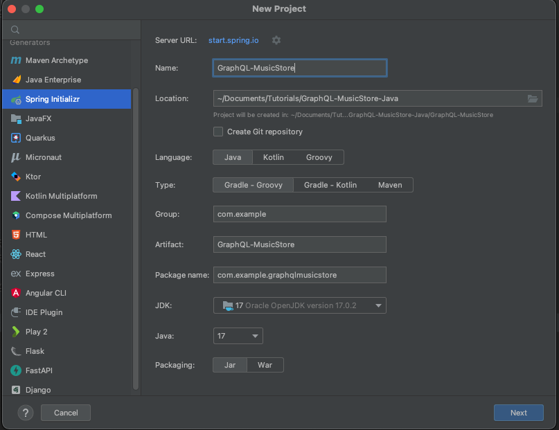
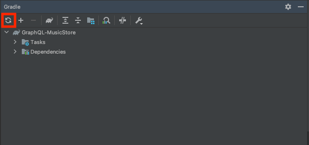

# Getting Started with GraphQL DGS 
## Create Spring Boot Project
Add the `Spring Initializr` plugin on IntelliJ

On IntelliJ goto `file` -> `new`



Set
- Language: Java
- Type: Gradle-Grooby
- JDK: 17
- Java: 17
- Package: Jar

Then click `Next`


The only dependency you will need is `Spring Web`

Click `Create`, now you created a Spring Boot Project

## Add GraphQL DGS
In build.gradle add the plugin `id "com.netflix.dgs.codegen" version "4.4.3"`
change the `org.springframework.boot` version to `2.4.4`

add the dependencies
```
implementation(platform("com.netflix.graphql.dgs:graphql-dgs-platform-dependencies:3.10.2"))
implementation "com.netflix.graphql.dgs:graphql-dgs-spring-boot-starter"
```

build.gradle sample
```
plugins {
    id 'java'
    id 'org.springframework.boot' version '2.4.4'
    id 'io.spring.dependency-management' version '1.1.0'
    id "com.netflix.dgs.codegen" version "4.4.3"
}

group = 'com.example'
version = '0.0.1-SNAPSHOT'
sourceCompatibility = '17'

repositories {
    mavenCentral()
}

dependencies {
    implementation 'org.springframework.boot:spring-boot-starter-web'
    testImplementation 'org.springframework.boot:spring-boot-starter-test'
        implementation(platform('com.netflix.graphql.dgs:graphql-dgs-platform-dependencies:3.10.2'))
    implementation 'com.netflix.graphql.dgs:graphql-dgs-spring-boot-starter'
}

tasks.named('test') {
    useJUnitPlatform()
}
```
## Add GraphQL Schema
Create a directory in `resources` called `schema`. Create a file called `schema.graphqls` under `schema` directory.

`src/main/resources/schema/schema.graphqls`
```
type Query {
    shows(titleFilter: String): [Show]
}

type Show {
    title: String
    releaseYear: Int
}
```

## Add DataFetcher 
In the same directory as your application class add the following file

`ShowsDataFetcher.java`
```
@DgsComponent
public class ShowsDatafetcher {

    private final List<Show> shows = List.of(
            new Show("Stranger Things", 2016),
            new Show("Ozark", 2017),
            new Show("The Crown", 2016),
            new Show("Dead to Me", 2019),
            new Show("Orange is the New Black", 2013)
    );

    @DgsQuery
    public List<Show> shows(@InputArgument String titleFilter) {
        if(titleFilter == null) {
            return shows;
        }

        return shows.stream().filter(s -> s.getTitle().contains(titleFilter)).collect(Collectors.toList());
    }
}
```

Generate the Show Type with the following command.
```
./gradlew generateJava
```
## Import your dependencies
Refresh gradle

And import all your class

## Spin up your GraphQL DGS App
To spin up you app run
```commandline
./gradlew bootRun
```

## Run GraphQL Query
Go to http:localhost:8080/graphiql

and run the following query
```graphql
query {
  shows {
    title
    releaseYear
  }
}
```


